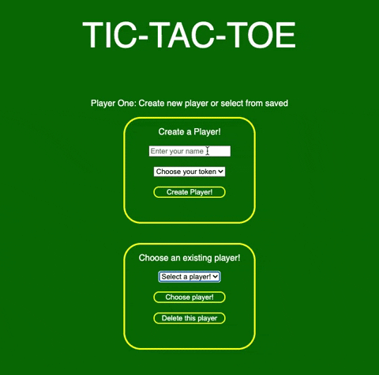
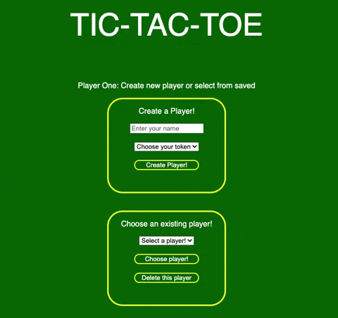
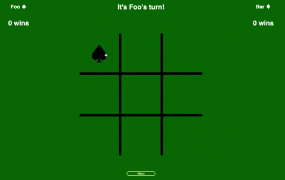
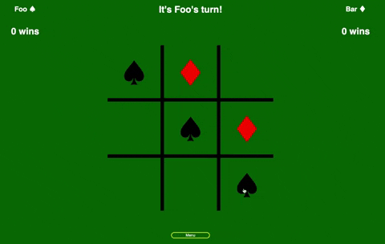
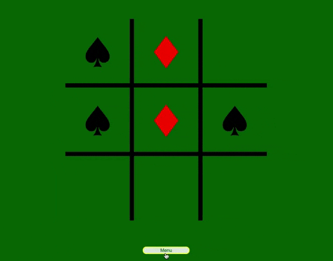

# Tic-Tac-Toe

This project allows users to play tic-tac-toe with their own created players and chosen tokens. Player data, including number of wins, is stored and can be deleted.

It runs in a web browser (Chrome is recommended).

https://github.com/JeffKersting/tic-tac-toe

## Player Creation and Selection Page

Users are able to create their own player and choose a token, or are able to choose a saved player. Upon player creation, the created player is added to the existing player drop-down menu options.

Users are also able to delete previously created players. Upon deletion, the existing player is removed from the existing player drop-down menu options.

## Game Page

When a user scrolls over a square, a preview of the token will appear. When the user leaves this square, the preview token will disappear. When a user clicks a square, the token is placed and the preview token hover is disabled on the selected square.

When a player wins the game the winning squares are animated and a win-state sound is played. Additionally a winning message is displayed, and the player score is updated. The winning message also instructs the losing player to choose a square to begin a new game.

 REPLACE

When a user clicks the menu button on the bottom of the game page, an menu appears and a blur effect is applied to all elements behind it. The token preview is disabled at this time. From the menu, users can exit the menu and preview token will be enabled for any squares that do not contain a player token. Users are also able to restart a game, or return to the player creation and selection page.

The javascript, HTML, and CSS on this site were written by Jeff Kersting. Special thanks to David Engel for conducting code review.
Win-state uses sound from freesound: win-state sound by Scrampunk https://freesound.org/people/Scrampunk/
